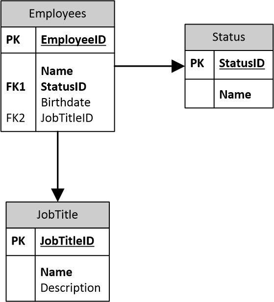

## This is the README for the CompanyAPI

## Requirements

Create a REST API application with the .NET Core framework using C# as your programming
language. 

Assume the database is a SQL Server database.

The application's database is as described by the entity relational diagram attached.
As for the REST API, these are the endpoints that we would like to see implemented:

- Insertion of a new employee
- Editing an existing employee
- Removing a employee
- List of all employees

